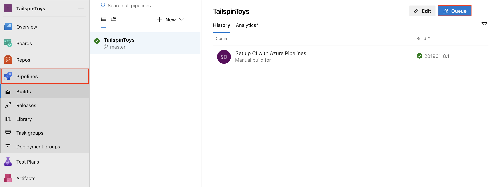
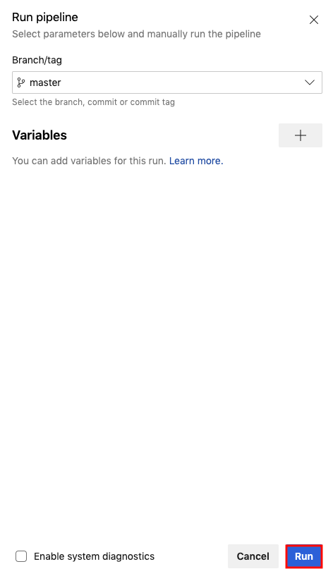
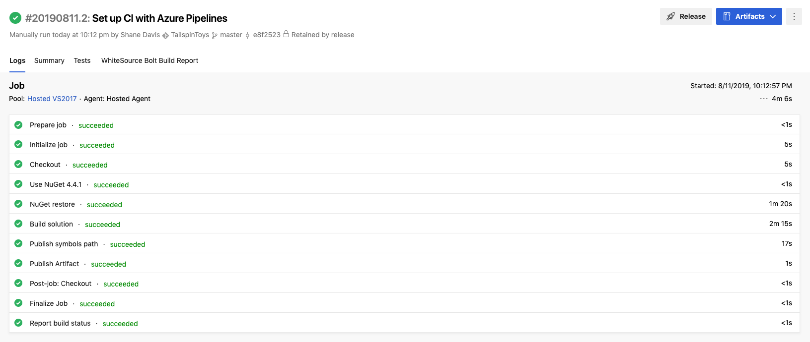

# Hands-on lab - Exercise 5

**Contents**
- [Setup](LabSetup)
- [Exercise 1](LabExercise01)
- [Exercise 2](LabExercise02)
- [Exercise 3](LabExercise03)
- [Exercise 4](LabExercise04)
- [Exercise 5](LabExercise05)
- [Exercise 6](LabExercise06)
- [Cleanup](LabCleanup)

[Last](LabExercise04) | [Home](lab) | [Next](LabExercise06)

## Exercise 5: Trigger a build and release

Duration: 10 Minutes

In this exercise, you will trigger an automated build and release of the web application using the build and release pipelines you created in earlier exercises. The release pipeline will deploy to three stages: dev, test, and production.

Any commit of new or modified code to the master branch will automatically trigger a build. The steps below are useful when you want to manually trigger a build without a code change.

### Task 1: Manually queue a new build and follow it through the release pipeline

1.  Select the "Pipelines" menu item from the left-hand navigation. Then, choose the "Queue" button. (NOTE: your screens might look a little different if you have the preview features for Azure DevOps turned on.)

    

2.  This will present a popup titled "Run pipeline". Select the "Run" button at the bottom of the popup.

    

3. The screen will refresh and begin to show details about the build process.

4.  If the build is successful, it will resemble the screen shot below.

    

5.  Because we configured continuous deployment, the deployment to the dev stage will then be triggered immediately. It will continue through on to the test and production stages. A successful release through all three stages will look like the screen shot below.

    
