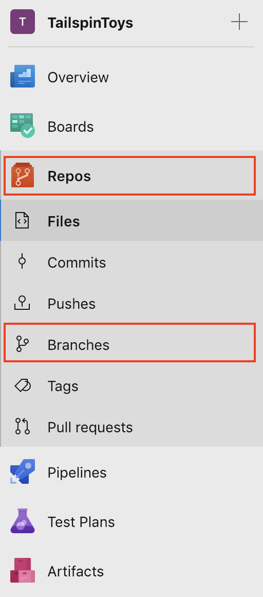
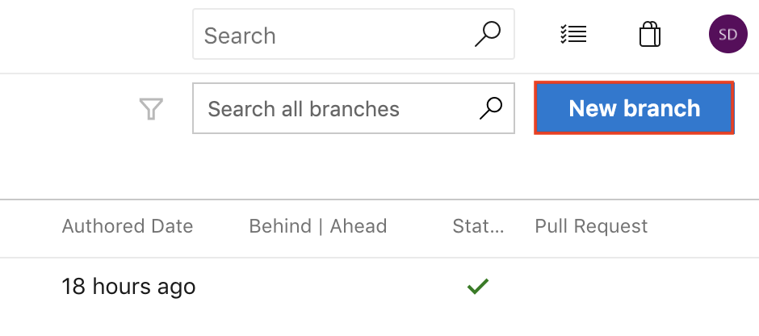
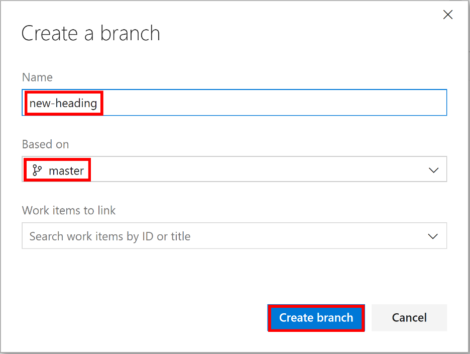
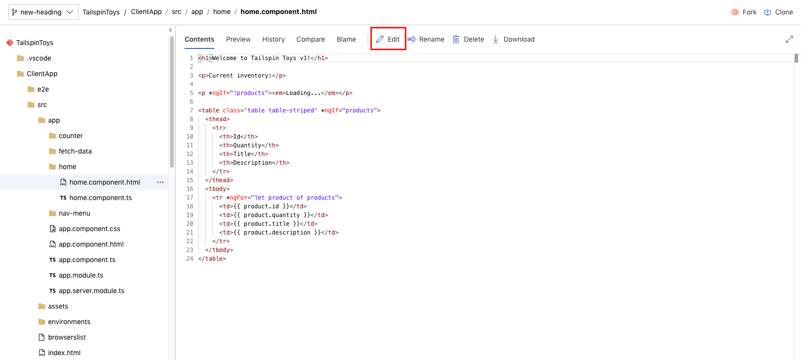
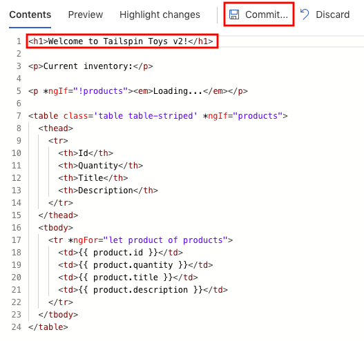
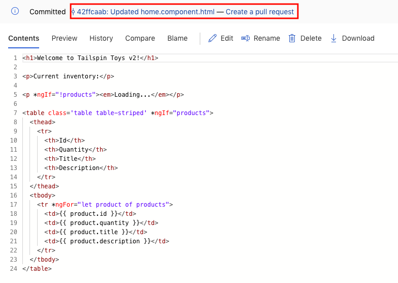
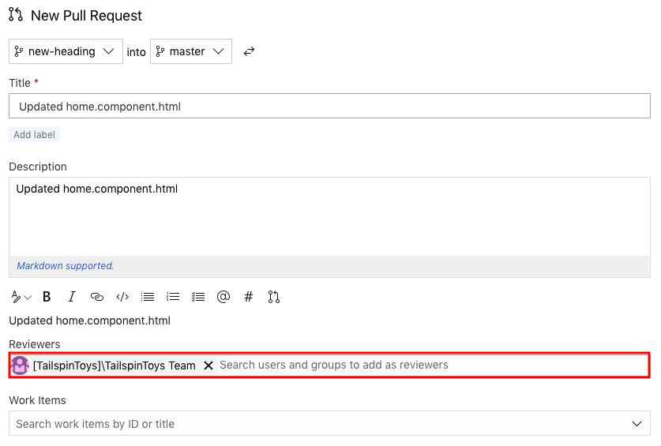
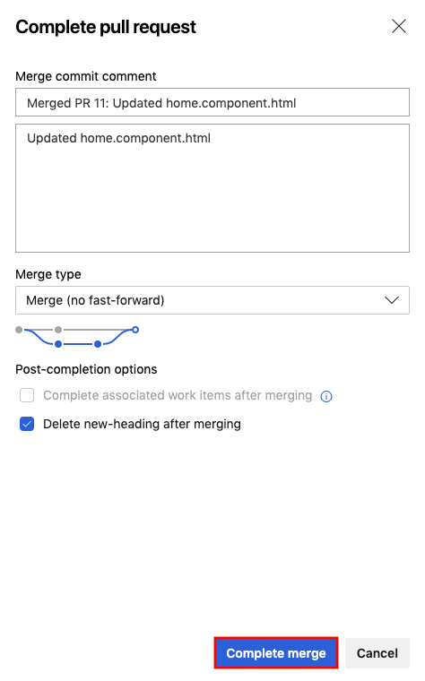

# Hands-on lab - Exercise 6

**Contents**
- [Setup](LabSetup)
- [Exercise 1](LabExercise01)
- [Exercise 2](LabExercise02)
- [Exercise 3](LabExercise03)
- [Exercise 4](LabExercise04)
- [Exercise 5](LabExercise05)
- [**Exercise 6**](LabExercise06)
- [Cleanup](LabCleanup)

[Last](LabExercise05) | [Home](lab) | [Next](LabCleanup)

## Exercise 6: Create a feature branch and submit a pull request

Duration: 20 Minutes

In this exercise, you will create a short-lived feature branch, make a small code change, commit the code, and submit a pull request. You'll then merge the pull request into the master branch which triggers an automated build and release of the application.

In the tasks below, you will make changes directly through the Azure DevOps web interface. These steps could also be performed through an IDE of your choosing or using the Azure Cloud Shell Code Editor.

### Task 1: Create a new branch

1.  Select the "Repos" menu item from the left-hand navigation. Then, choose "Branches".

    

2.  Select the "New branch" button in the upper right corner of the page.

    

3.  In the "Create a branch" dialog, enter a name for the new branch. In this scenario, name it "new-heading". In the "Based on" field, be sure **master** is selected.

    

4.  Select "Create branch".

### Task 2: Make a code change to the feature branch

1.  Choose the name of the newly created branch. This will present the "Files" window showing all the files in the repository.

    

2.  Next, you'll make a change to a page in the web application inside the web browser.

3.  Select the "ClientApp" folder.

4.  Then choose the "src" folder.

5.  Next select the "app" folder.

6.  Then, the "home" folder.

7.  Locate and select the "home.component.html" file. It will display the contents of the file.

8.  Select the "Edit" button on the top right of the screen to begin editing the page.

    

9.  Replace the code ```<h1>Welcome to Tailspin Toys v1!</h1>``` on line 1 with the following:

    ```
    <h1>Welcome to Tailspin Toys v2!</h1>
    ```
    
10.  Now that you've completed the code change, select the "Commit..." button on the top right side of the screen.

  

11. This will present the Commit popup where you can enter a comment. Select the "Commit" button.

    

### Task 3: Submit a pull request

1.  Near the top of the screen, locate the "Create a pull request" link.

    

2.  This brings up the "New Pull Request" page. It shows we are submitting a request to merge code from our **new-heading** branch into the **master** branch. You have the option to change the "Title" and "Description" fields. Locate the "Reviewers" field. Type in **Tailspin** and select the search tooltip. Select the **[TailspinToys]\Tailspin Toys** team from the search results. This assigns The TailspinToys Team (which you are a member of) to review this pull request before it will be merged. The details of the code change are at the bottom of the page.

    

3.  Select the "Create" button to submit the pull request.

### Task 4: Approve and complete a pull request

Typically, the next few steps would be performed by another team member. This would allow for the code to be peer reviewed. However, in this scenario, you will continue as if you are the only developer on the project.

1.  After submitting the pull request, you are presented with Pull Request review screen. Let's assume all the changes made were acceptable to the review team.

2.  First, select the "Approve" button to approve of the code that was modified submitted as part of the pull request.

3.  This will note that you approved the pull request. Then, choose the "Complete" button to finish and merge the code from the pull request into the master branch.

    

4.  After choosing the Complete button in the previous step, you will be presented with the Complete pull request popup. You can add additional comments for the merge activity. By selecting the "Delete new-heading after merging" option, our branch will be deleted after the merge has been completed. This keeps our repository clean of old and abandoned branches and eliminates the possibility of future confusion.

    

5.  Select the "Complete merge" button.

6.  You will then see a confirmation of the completed pull request.

    

7.  Congratulations! You just created a branch, made a code change, submitted a pull request, approved the pull request, and merged the code.

8.  Because we configured continuous integration and continuous deployment, an automated build will be triggered and deployment to dev stage will then begin immediately after a successful build. It will continue through on to the test and production stages.

    

[Last](LabExercise05) | [Home](lab) | [Next](LabCleanup)